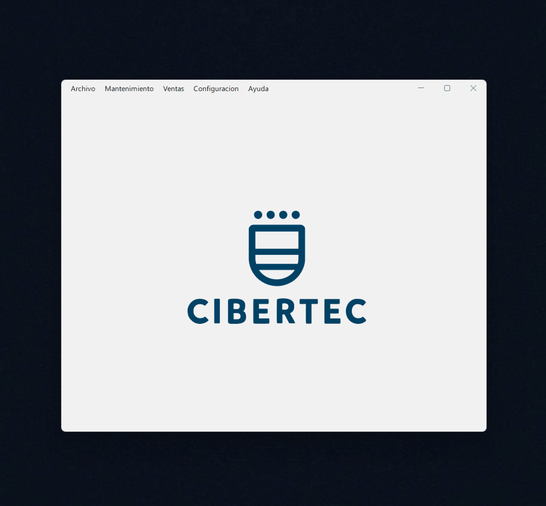

# Proyecto Final Java T1BO

proyecto final de algoritma donde se emplearon conceptos como estructura secuencial, estructura de controls, declaracion de variables, definicion de metodos y su implementacion , asi como otros conceptos como modulos o paquetes para la agrupacion y importacion de codigos en distintos ficheros.
Se utilizo el lenguaje de programacion de java ya que cuenta con la caracteristicas para implementar dichos  conceptos anteriormente mencionados, y tambien es un requerimiento demandado por la guia del docente de la institucion (CIBERTEC) a la cual se presentara el proyecto para su respectiva evaluacion y calificacion  respectiva.

### OBJETIVOS ALCANZADOS

Los objetivos y conocimiento adquiridos por parte de los participantes al culminar con este proyecto son las siguientes:

- :white_check_mark: crear una solución algorítmica para el problema propuesto usando las 
estructuras algorítmicas apropiadas.
- white_check_mark: Implementar una solución algorítmica usando el lenguaje Java.
- white_check_mark: Utilizacion de los conceptos adquiridos en las clases virtuales y implementados en el codigo java.
- white_check_mark: Refactorizacion de codigo para su mejora, empleando las buenas practicas de codificacion.
- white_check_mark: Utilizacion de librerias como flatlaf-3.1.1.jar para implementar mejoras en el programa.
- [white_check_mark: Utilizacion de Git como sistema de versionamiento de nuestro proyecto.
- white_check_mark: Comprendiendo las limitaciones del proyecto dado por las reglas del requerimiento del documento Proyecto_IA_2023_02.pdf

## ESPECIFICACIÓN Y ALCANCE DEL PROYECTO

La solucion de este proyecto cuenta con las siguientes caracteristicas basadas en el documento (PDF) Proyecto_IA_2023_02.pdf donde se detallan.

### Estructura del Menu: 

- Archivo
  - Salir
- Mantenimiento
  - Consultar cerámico
  - Modificar cerámico
  - Listar cerámicos

- Ventas
  - Vender
  - Generar reportes
- Configuración
  - Configurar descuentos
  - Configurar obsequios
  - Configurar cantidad óptima
  - Configurar cuota diaria
- Ayuda
  - Acerca de Tienda

### Persistencia de Datos

debido a las limitaciones y reglas del proyecto , se utilizacion variables de clases estaticas para almacenar datos de configuracion y elementos de almacen ceramico como tambien estados de compras, y esta mas que decir que las variables se restableceran como estan definidos inicialmente al liberar el programa de la memoria ram al cerrar el programa.

### CAPTURA

